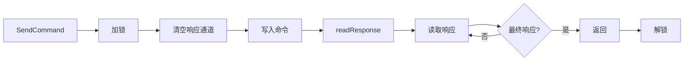

# Go AT 命令通信库

[](https://go.dev/)
[](LICENSE)
[]()

一个轻量级的 Go 语言 AT 命令通信库，用于和串口 Modem 设备进行交互。

## 目录

- [模块结构](#模块结构)
- [功能特性](#功能特性)
- [快速开始](#快速开始)
- [核心概念](#核心概念)
- [设备命令](#设备命令)
- [网络管理](#网络管理)
- [通话功能](#通话功能)
- [短信功能](#短信功能)
  - [短信配置](#短信配置)
  - [发送短信](#发送短信)
  - [短信息列表](#短信息列表)
  - [短信息删除](#短信息删除)
- [通知处理](#通知处理)
- [高级配置](#高级配置)
- [最佳实践](#最佳实践)
- [内部机制](#内部机制)
- [常见问题](#常见问题)

## 模块结构

```text
at/
├── base.go          # 核心设备接口、并发控制、读写循环
├── command.go       # AT 命令集定义
├── response.go      # 响应类型集定义
├── notification.go  # 通知类型集定义（URC）
├── device_basic.go  # 基本控制、设备信息、SIM 卡管理
├── device_network.go # 网络状态、APN 配置、通知管理
├── device_call.go   # 语音通话、来电显示、呼叫转移
├── device_sms.go    # 短信收发（PDU 模式）
└── README.md        # 本文档
```

### 依赖模块

- `github.com/rehiy/modem/sms` - 短信编解码（GSM 7-bit、UCS2）
- `github.com/rehiy/modem/sms/pdumode` - PDU 格式处理

## 功能特性

- 🚀 **完整的 AT 命令接口** - 基础命令、设备信息、网络状态、通话、短信等
- 🎯 **智能响应处理** - 自动识别最终响应（OK/ERROR 等）和通知消息（URC）
- 🔒 **并发安全** - 使用原子操作和互斥锁保证线程安全
- ⚙️ **可扩展配置** - 支持自定义命令集、响应集和通知集
- 📱 **短信功能** - PDU 模式、长短信自动合并、编码检测
- 🔔 **通知监听** - 来电、短信、网络状态变化等实时通知
- 📡 **网络管理** - APN 配置、PDP 上下文、IP 地址查询
- 📞 **通话管理** - 拨号、接听、挂断、来电显示、呼叫转移

## 快速开始

### 安装

```bash
go get github.com/rehiy/modem
```

### 基本示例

```go
package main

import (
    "log"
    "time"

    "github.com/rehiy/modem/at"
)

func main() {
    // 1. 创建串口连接
    portName := "/dev/ttyUSB0" // 串口完整路径
    port, err := serial.OpenPort(&serial.Config{
        Name:        portName,
        Baud:        115200, // 波特率
        ReadTimeout: 1 * time.Second,
    })
    if err != nil {
        log.Fatal(err)
    }
    defer port.Close()

    // 2. 配置通知处理函数
    urcHandler := func(label string, param map[int]string) {
        log.Printf("通知: %s %v", label, param)
    }

    // 3. 创建设备实例
    config := &at.Config{
        Timeout: 5 * time.Second,
    }
    device := at.New(port, urcHandler, config)
    defer device.Close()

    // 4. 测试连接
    if err := device.Test(); err != nil {
        log.Fatal(err)
    }

    // 5. 查询设备信息
    manufacturer, _ := device.GetManufacturer()
    model, _ := device.GetModel()
    log.Printf("设备: %s %s", manufacturer, model)

    // 6. 查询信号质量
    rssi, ber, _ := device.GetSignalQuality()
    log.Printf("信号强度: %d, 误码率: %d", rssi, ber)
}
```

## 核心概念

### Port 接口

`Port` 接口定义了与串口设备交互的基本方法，用户需要自行实现：

```go
type Port interface {
    Read(buf []byte) (int, error)
    Write(data []byte) (int, error)
    Flush() error
    Close() error
}
```

**推荐实现库：**

- [github.com/tarm/serial](https://github.com/tarm/serial)
- [go.bug.st/serial](https://github.com/bugst/go-serial)

### 通知处理函数

`UrcHandler` 是处理 URC（Unsolicited Result Code）通知的回调函数类型：

```go
type UrcHandler func(label string, param map[int]string)
```

- `label`: 通知标签（如 `+CMTI`, `RING`, `+CREG`）
- `param`: 通知参数映射（索引从 0 开始）

### Device 方法

```go
// 创建设备连接
func New(port Port, handler UrcHandler, config *Config) *Device

// 连接管理
func (m *Device) IsOpen() bool
func (m *Device) Close() error

// 命令发送
func (m *Device) SendCommand(cmd string) ([]string, error)
func (m *Device) SendCommandExpect(cmd, expected string) error
```

### 配置结构

```go
type Config struct {
    Timeout         time.Duration        // 超时时间（默认 1 秒）
    CommandSet      *CommandSet          // 自定义 AT 命令集（可选）
    ResponseSet     *ResponseSet         // 自定义响应类型集（可选）
    NotificationSet *NotificationSet     // 自定义通知类型集（可选）
    Printf          func(string, ...any) // 日志输出函数（可选）
}
```

## 设备命令

### 基本控制

| 方法 | AT 命令 | 说明 |
|------|---------|------|
| `Test()` | `AT` | 测试连接 |
| `EchoOff()` | `ATE0` | 关闭回显 |
| `EchoOn()` | `ATE1` | 开启回显 |
| `Reset()` | `ATZ` | 重启模块 |
| `FactoryReset()` | `AT&F` | 恢复出厂设置 |
| `SaveSettings()` | `AT&W` | 保存设置 |
| `LoadProfile(profile)` | `ATZ<profile>` | 加载配置文件 |
| `SaveProfile(profile)` | `AT&W<profile>` | 保存配置文件 |

```go
device.Test()
device.EchoOff()
device.Reset()
device.SaveSettings()
device.LoadProfile(1)  // 加载配置文件1
```

### 设备信息

| 方法 | AT 命令 | 返回值 | 说明 |
|------|---------|--------|------|
| `GetIMEI()` | `AT+CGSN` | `(string)` | IMEI 码 |
| `GetManufacturer()` | `AT+CGMI` | `(string)` | 制造商 |
| `GetModel()` | `AT+CGMM` | `(string)` | 型号 |
| `GetRevision()` | `AT+CGMR` | `(string)` | 版本号 |
| `GetIMSI()` | `AT+CIMI` | `(string)` | IMSI 码 |
| `GetICCID()` | `AT+CCID` | `(string)` | ICCID 码 |
| `GetNumber()` | `AT+CNUM` | `(string, int)` | 手机号, 号码类型 |

```go
imei, _ := device.GetIMEI()
manufacturer, _ := device.GetManufacturer()
model, _ := device.GetModel()
revision, _ := device.GetRevision()
imsi, _ := device.GetIMSI()
iccid, _ := device.GetICCID()
number, numType, _ := device.GetNumber()
// numType: 129=国际, 161=国内
```

### 设备状态

| 方法 | AT 命令 | 返回值 | 说明 |
|------|---------|--------|------|
| `GetBatteryLevel()` | `AT+CBC` | `(int, int)` | 充电状态, 电量百分比 |
| `GetDeviceTemp()` | `AT+CPMUTEMP` | `(int, int)` | 温度, 状态 |
| `GetNetworkTime()` | `AT+CCLK?` | `(string)` | 网络时间 |
| `SetTime(timeStr)` | `AT+CCLK` | - | 设置时间 |

```go
charging, level, _ := device.GetBatteryLevel()
// charging: 0=未充电, 1=充电中
// level: 0-100 电量百分比
log.Printf("充放电: %d, 电量: %d%%", charging, level)

temp, status, _ := device.GetDeviceTemp()
// temp: 温度值
// status: 0=正常, 1=过热

timeStr, _ := device.GetNetworkTime()
// 时间格式: "YY/MM/DD,HH:MM:SS+TZ"

// 设置时间格式: "YY/MM/DD,HH:MM:SS+TZ"
device.SetTime("26/01/13,12:30:45+08")
```

### SIM 卡管理

| 方法 | AT 命令 | 说明 |
|------|---------|------|
| `GetSIMStatus()` | `AT+CPIN?` | 查询 SIM 状态 |
| `VerifyPIN(pin)` | `AT+CPIN=<pin>` | 验证 PIN 码 |
| `ChangePIN(old, new)` | `AT+CPWD=<old>,<new>` | 修改 PIN 码 |
| `UnlockPIN(pinType, enable, pwd)` | `AT+CLCK` | 锁定/解锁 PIN |

```go
status, _ := device.GetSIMStatus()
// 返回值: "READY", "SIM PIN", "SIM PUK" 等

device.VerifyPIN("1234")
device.ChangePIN("1234", "5678")

// 启用 PIN 锁
device.UnlockPIN("SC", true, "5678")
```

## 网络管理

### 网络状态

| 方法 | AT 命令 | 返回值 | 说明 |
|------|---------|--------|------|
| `GetOperator()` | `AT+COPS?` | `(int, int, string, int)` | 模式, 格式, 运营商, 接入技术 |
| `GetNetworkMode()` | `AT+CNMP?` | `(int)` | 网络模式 |
| `SetNetworkMode(mode)` | `AT+CNMP` | - | 设置网络模式 |
| `GetNetworkStatus()` | `AT+CREG?` | `(int, int)` | 通知模式, 注册状态 |
| `GetGPRSStatus()` | `AT+CGREG?` | `(int, int)` | 通知模式, 注册状态 |
| `GetSignalQuality()` | `AT+CSQ` | `(int, int)` | 信号强度, 误码率 |

```go
mode, _, operator, act, _ := device.GetOperator()
// mode: 0=自动, 1=手动, 2=取消注册
// act: 0=GSM, 2=UTRAN, 3=GSM w/EGPRS, 4=UTRAN w/HSDPA, 7=E-UTRA
log.Printf("运营商: %s, 接入技术: %d", operator, act)

networkMode, _ := device.GetNetworkMode()
// 常用模式: 2=AUTOMATIC, 13=GSM ONLY, 38=LTE ONLY, 51=SA/NSA
device.SetNetworkMode(38)

n, stat, _ := device.GetNetworkStatus()
// n: 0=禁用, 1=启用, 2=启用并显示位置信息
// stat: 0=未注册, 1=已注册本地, 2=未注册但正在搜索, 3=注册被拒绝, 5=已注册漫游

rssi, ber, _ := device.GetSignalQuality()
// rssi: 0-31 (31=最佳, 99=未知), dBm = -113 + 2*rssi
// ber: 0-7 (0=最佳, 99=未知)
log.Printf("信号: RSSI=%d, BER=%d", rssi, ber)
```

### 网络配置

| 方法 | AT 命令 | 参数 | 返回值 | 说明 |
|------|---------|------|--------|------|
| `GetAPN(cid)` | `AT+CGDCONT?` | cid | `(int, string, string)` | cid, pdpType, apn |
| `SetAPN(cid, pdpType, apn)` | `AT+CGDCONT` | cid, pdpType, apn | - | 设置 APN |
| `GetPDPContext(cid)` | `AT+CGACT?` | cid | `(int, int)` | cid, state |
| `SetPDPContext(cid, state)` | `AT+CGACT` | cid, state | - | 激活/停用 PDP |
| `GetIPAddress(cid)` | `AT+CGPADDR?` | cid | `(int, string)` | cid, ipAddress |

```go
// 设置 APN
// cid: 上下文标识符
// pdpType: PDP 类型 ["IP", "IPV6", "IPV4V6"]
// apn: 接入点名称
device.SetAPN(1, "IP", "cmnet")

// 激活 PDP 上下文
// state: 0=停用, 1=激活
device.SetPDPContext(1, 1)

// 查询 IP 地址
cid, ip, _ := device.GetIPAddress(1)
log.Printf("CID: %d, IP: %s", cid, ip)
```

### 通知管理

| 方法 | AT 命令 | 参数 | 返回值 | 说明 |
|------|---------|------|--------|------|
| `GetNetworkRegNotify()` | `AT+CREG?` | - | `(int)` | 通知模式 |
| `SetNetworkRegNotify(mode)` | `AT+CREG` | mode | - | 设置网络注册通知 |
| `GetGPRSRegNotify()` | `AT+CGREG?` | - | `(int)` | 通知模式 |
| `SetGPRSRegNotify(mode)` | `AT+CGREG` | mode | - | 设置 GPRS 注册通知 |
| `SetSignalReport(mode, interval)` | `AT+CSQ` | mode, interval | - | 设置信号质量上报 |

```go
// 查询网络注册通知状态
mode, _ := device.GetNetworkRegNotify()
// mode: 0=禁用, 1=启用, 2=启用并显示位置信息

// 启用网络注册通知并显示位置信息
device.SetNetworkRegNotify(2)

// 启用 GPRS 注册通知
device.SetGPRSRegNotify(2)

// 开启信号质量上报
// mode: 0=关闭, 1=开启
// interval: 上报间隔(秒) [1-255]
device.SetSignalReport(1, 10)
```

## 通话功能

| 方法 | AT 命令 | 返回值 | 说明 |
|------|---------|--------|------|
| `Dial(number)` | `ATD<number>` | - | 拨打电话 |
| `Answer()` | `ATA` | - | 接听电话 |
| `Hangup()` | `ATH` | - | 挂断电话 |
| `GetCallerID()` | `AT+CLIP?` | `(bool)` | 来电显示状态 |
| `SetCallerID(enable)` | `AT+CLIP` | enable | - | 设置来电显示 |
| `GetCallState()` | `AT+CLCC` | `([]CallInfo)` | 通话状态列表 |
| `GetCallWait()` | `AT+CCWA?` | `(bool)` | 呼叫等待状态 |
| `SetCallWait(enable)` | `AT+CCWA` | enable | - | 设置呼叫等待 |
| `GetCallFWD(reason)` | `AT+CCFC?` | `(bool, string)` | 状态, 转移号码 |
| `SetCallFWD(reason, enable, number)` | `AT+CCFC` | reason, enable, number | - | 设置呼叫转移 |

```go
// 拨打电话
device.Dial("+8613800138000")

// 接听和挂断
device.Answer()
device.Hangup()

// 来电显示
enabled, _ := device.GetCallerID()
// enabled: true=启用, false=禁用
device.SetCallerID(true)

// 查询通话状态
calls, _ := device.GetCallState()
for _, call := range calls {
    log.Printf("ID: %d, 号码: %s, 状态: %d, 方向: %d",
        call.ID, call.Number, call.Status, call.Dir)
}
```

### CallInfo 结构

```go
type CallInfo struct {
    ID     int    // 通话标识
    Dir    int    // 方向 [0: 呼出, 1: 呼入]
    Status int    // 状态 [0: 活动中, 1: 保持中, 2: 拨号中, 3: 响铃中, 4: 来电中]
    Mode   int    // 模式 [0: 语音, 1: 数据, 2: 传真]
    Number string // 号码
    Type   int    // 号码类型 [129: 国际, 161: 国内]
    Multip int    // 多方通话
}
```

### 呼叫转移

```go
// 设置无条件呼叫转移
// reason: 转移原因
//   0=无条件
//   1=遇忙
//   2=无应答
//   3=无法接通
//   4=所有
// enable: true=启用, false=禁用
// number: 转移号码
device.SetCallFWD(0, true, "+8613900000000")

// 查询呼叫转移状态
enabled, number, _ := device.GetCallFWD(0)
// enabled: true=已启用, false=未启用
log.Printf("呼叫转移: %v, 转移到: %s", enabled, number)
```

## 短信功能

### 短信配置

| 方法 | AT 命令 | 参数 | 返回值 | 说明 |
|------|---------|------|--------|------|
| `GetSmsMode()` | `AT+CMGF?` | - | `(int)` | 获取短信模式 |
| `SetSmsMode(v)` | `AT+CMGF` | v | - | 设置短信模式 |
| `GetSmsStorage()` | `AT+CPMS?` | - | `(string, string, string)` | 获取存储配置 |
| `SetSmsStorage(v1, v2, v3)` | `AT+CPMS` | v1, v2, v3 | - | 设置存储位置 |
| `GetSmsCenter()` | `AT+CSCA?` | - | `(string)` | 获取短信中心号码 |
| `SetSmsCenter(number)` | `AT+CSCA` | number | - | 设置短信中心号码 |

```go
// 查询短信模式
mode, _ := device.GetSmsMode()
// 返回值: 0=PDU模式, 1=TEXT模式

// 设置为 PDU 模式
device.SetSmsMode(0)

// 查询存储配置
readStore, writeStore, receiveStore, _ := device.GetSmsStorage()
// ME=手机内存, SM=SIM卡存储

// 设置存储位置（读、写、接收都使用手机内存）
device.SetSmsStorage("ME", "ME", "ME")

// 查询短信中心号码
center, _ := device.GetSmsCenter()

// 设置短信中心号码
device.SetSmsCenter("+8613800100500")
```

### 发送短信

| 方法 | 说明 |
|------|------|
| `SendSmsPdu(number, message)` | 发送短信（PDU 模式） |

```go
// 设置为 PDU 模式
device.SetSmsMode(0)

// 发送短信
device.SendSmsPdu("+8613800138000", "Hello from Go!")
device.SendSmsPdu("+8613800138000", "你好，这是一条中文短信！")
```

### 短信列表

| 方法 | AT 命令 | 参数 | 说明 |
|------|---------|------|------|
| `ListSmsPdu(stat)` | `AT+CMGL=<stat>` | stat | 获取短信列表 |

```go
// 列出所有短信
list, _ := device.ListSmsPdu(4)
for _, sms := range list {
    log.Printf("来自: %s, 内容: %s, 时间: %s",
        sms.Number, sms.Text, sms.Time)
}
```

### 短信删除

| 方法 | AT 命令 | 参数 | 说明 |
|------|---------|------|------|
| `DeleteSms(indices)` | `AT+CMGD=<index>` | indices | 批量删除指定索引的短信 |

```go
// 删除指定索引的短信
device.DeleteSms([]int{1, 2, 3})
```

### SMS 结构

```go
type Sms struct {
    Number  string `json:"number"`  // 电话号码
    Text    string `json:"text"`    // 短信内容
    Time    string `json:"time"`    // 时间戳
    Index   int    `json:"index"`   // 首个分片的索引
    Indices []int  `json:"indices"` // 所有分片的索引
    Status  string `json:"status"`  // 短信状态
}
```

**字段说明：**
- `Number`: 发送者电话号码
- `Text`: 短信文本内容（自动合并长短信）
- `Time`: 短信时间，格式为 "2006/01/02 15:04:05"
- `Index`: 首个分片的索引位置
- `Indices`: 所有分片的索引列表（长短信会有多个分片）
- `Status`: 短信状态字符串

### 短信状态

| 状态值 | 说明 |
|--------|------|
| 0 | REC UNREAD - 未读短信 |
| 1 | REC READ - 已读短信 |
| 2 | STO UNSENT - 未发短信 |
| 3 | STO SENT - 已发短信 |
| 4 | ALL - 全部短信 |

## 通知处理

通知处理函数在创建设备时传入，自动监听各类 URC（Unsolicited Result Code）：

```go
urcHandler := func(label string, param map[int]string) {
    switch label {
    case "+CMTI": // 新短信通知
        index := param[0]
        log.Println("收到新短信，索引:", index)

    case "RING": // 来电
        log.Println("电话响铃")

    case "+CLIP": // 来电显示
        number := param[0]
        log.Println("来电号码:", number)

    case "+CREG": // 网络状态变化
        stat := param[1]
        log.Println("网络状态:", stat)
    }
}
```

**常用通知类型：**

| 通知类型 | 说明 |
|---------|------|
| `RING` | 来电响铃 |
| `+CLIP` | 来电显示 |
| `+CMTI` | 新短信到达 |
| `+CMT` | 短信内容推送 |
| `+CREG` | 网络注册状态 |
| `+CGREG` | GPRS 注册状态 |
| `+CIEV` | 设备状态变化 |

## 高级配置

### 自定义命令集

适用于不同厂商的扩展命令：

```go
commands := at.DefaultCommandSet()
commands.Signal = "AT^HCSQ"  // 华为扩展命令

config := &at.Config{
    Timeout:    5 * time.Second,
    CommandSet: commands,
}
```

### 自定义响应集

添加自定义最终响应：

```go
responses := at.DefaultResponseSet()
responses.CustomFinal = []string{"CUSTOM_OK", "COMPLETE"}

config := &at.Config{
    ResponseSet: responses,
}
```

### 自定义通知集

适配特定厂商的 URC 格式（厂商前缀可能不同）：

```go
notifications := at.DefaultNotificationSet()
// 某些厂商可能在 URC 前缀前添加厂商标识
notifications.NetworkReg = "^CREG"
notifications.IndicationEvent = "^CIEV"

config := &at.Config{
    NotificationSet: notifications,
}
```

## 最佳实践

### 1. 错误处理

```go
responses, err := device.SendCommand("AT+CREG?")
if err != nil {
    // 处理错误
    log.Printf("命令执行失败: %v", err)
    return
}
// 处理响应
for _, line := range responses {
    fmt.Println(line)
}
```

### 2. 超时设置

```go
// 根据设备响应特性调整超时时间
config := &at.Config{
    Timeout: 10 * time.Second, // 慢速设备使用更长超时
}
```

### 3. 日志调试

```go
// 自定义日志函数
config := &at.Config{
    Printf: func(format string, args ...any) {
        log.Printf("[AT-DEBUG] "+format, args...)
    },
}
```

### 4. 并发调用

库已内置互斥锁保护，可安全并发调用：

```go
var wg sync.WaitGroup

// 多个 goroutine 并发查询
wg.Add(2)
go func() {
    defer wg.Done()
    device.GetSignalQuality()
}()
go func() {
    defer wg.Done()
    device.GetOperator()
}()
wg.Wait()
```

## 内部机制

### 通信流程



1. **读取循环** (`readAndDispatch`)
   - 持续从串口读取数据
   - 去除空白字符
   - 识别 URC 通知，交由 `urcHandler` 处理
   - 其他数据写入响应通道

2. **命令发送** (`SendCommand`)
   - 加互斥锁，保证"命令写入-响应读取"的原子性
   - 清空响应通道，避免收到残留响应
   - 自动检查并添加结束符 `\r\n`
   - 发送命令并等待最终响应

3. **响应读取** (`readResponse`)
   - 从响应通道读取数据
   - 检测最终响应（OK/ERROR 等）
   - 超时返回错误

### 并发安全机制

| 资源 | 保护方式 | 说明 |
|------|---------|------|
| `closed` | `atomic.Bool` | 原子操作，保证并发安全 |
| `mu` | `sync.Mutex` | 保护整个 `SendCommand` 流程，防止响应错乱 |
| `responseChan` | 带缓冲通道 | 容量 100，非阻塞写入 |

## 常见问题

### Q1: 如何实现 Port 接口？

```go
import "github.com/tarm/serial"

func openSerialPort(portName string, baudRate int) at.Port {
    config := &serial.Config{
        Name:        portName,
        Baud:        baudRate,
        ReadTimeout: time.Second,
    }
    port, err := serial.OpenPort(config)
    if err != nil {
        log.Fatal(err)
    }
    return port
}
```

### Q2: 如何处理超时？

检查错误信息，适当增加超时时间：

```go
responses, err := device.SendCommand("AT+CMD?")
if err != nil && strings.Contains(err.Error(), "timeout") {
    log.Println("命令超时，设备可能响应较慢")
}
```

### Q3: 通知和响应如何区分？

库通过 `NotificationSet.IsNotification()` 自动判断：

- 匹配 URC 前缀 → 通知，发送给 `urcHandler`
- 不匹配 → 响应，写入 `responseChan`

## 许可证

MIT License
