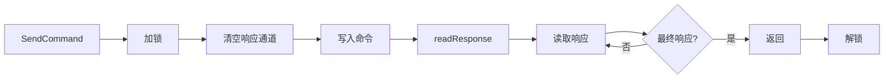

# Go AT 命令通信库

[](https://go.dev/)
[](LICENSE)
[]()

一个轻量级的 Go 语言 AT 命令通信库，用于和串口 Modem 设备进行交互。

## 目录

- [功能特性](#功能特性)
- [快速开始](#快速开始)
- [核心概念](#核心概念)
- [设备命令](#设备命令)
- [短信功能](#短信功能)
- [通知处理](#通知处理)
- [高级配置](#高级配置)
- [最佳实践](#最佳实践)
- [内部机制](#内部机制)
- [常见问题](#常见问题)

## 功能特性

- 🚀 **完整的 AT 命令接口** - 基础命令、信息查询、信号质量、网络状态、通话、短信等
- 🎯 **智能响应处理** - 自动识别最终响应（OK/ERROR 等）和通知消息（URC）
- 🔒 **并发安全** - 使用原子操作和互斥锁保证线程安全
- ⚙️ **可扩展配置** - 支持自定义命令集、响应集和通知集
- 📱 **短信功能** - 自动编码检测（ASCII/UCS2）、长短信自动分段
- 🔔 **通知监听** - 来电、短信、网络状态变化等实时通知

## 快速开始

### 安装

```bash
go get github.com/rehiy/modem
```

### 基本示例

```go
package main

import (
 "log"
 "time"

 "github.com/rehiy/modem/at"
)

func main() {
 // 1. 创建串口连接（需自行实现 Port 接口）
 port := openSerialPort("/dev/ttyUSB0", 115200)
 defer port.Close()

 // 2. 配置通知处理函数
 urcHandler := func(label string, param map[int]string) {
  log.Printf("通知: %s %v", label, param)
 }

 // 3. 创建设备实例
 config := &at.Config{
  Timeout: 5 * time.Second,
 }
 device := at.New(port, urcHandler, config)
 defer device.Close()

 // 4. 测试连接
 if err := device.Test(); err != nil {
  log.Fatal(err)
 }

 // 5. 查询设备信息
 manufacturer, _ := device.GetManufacturer()
 model, _ := device.GetModel()
 log.Printf("设备: %s %s", manufacturer, model)

 // 6. 查询信号质量
 rssi, ber, _ := device.GetSignalQuality()
 log.Printf("信号强度: %d, 误码率: %d", rssi, ber)
}
```

## 核心概念

### Port 接口

`Port` 接口定义了与串口设备交互的基本方法，用户需要自行实现：

```go
type Port interface {
 Read(buf []byte) (int, error)
 Write(data []byte) (int, error)
 Flush() error
 Close() error
}
```

**推荐实现库：**

- [github.com/tarm/serial](https://github.com/tarm/serial)
- [go.bug.st/serial](https://github.com/bugst/go-serial)

### Device 方法

```go
// 创建设备连接
func New(port Port, handler UrcHandler, config *Config) *Device

// 连接管理
func (m *Device) IsOpen() bool
func (m *Device) Close() error

// 命令发送
func (m *Device) SendCommand(cmd string) ([]string, error)
func (m *Device) SendCommandExpect(cmd, expected string) error
```

### 配置结构

```go
type Config struct {
 Timeout         time.Duration        // 超时时间（默认 1 秒）
 CommandSet      *CommandSet          // 自定义 AT 命令集（可选）
 ResponseSet     *ResponseSet         // 自定义响应类型集（可选）
 NotificationSet *NotificationSet     // 自定义通知类型集（可选）
 Printf          func(string, ...any) // 日志输出函数（可选）
}
```

## 设备命令

### 基本命令

```go
device.Test()           // 测试连接
device.EchoOff()        // 关闭回显
device.EchoOn()         // 开启回显
device.Reset()          // 软件复位
device.FactoryReset()   // 恢复出厂设置
device.SaveSettings()   // 保存设置
```

### 信息查询

```go
// 设备信息
manufacturer, _ := device.GetManufacturer()
model, _ := device.GetModel()
revision, _ := device.GetRevision()
serial, _ := device.GetSerialNumber()
imsi, _ := device.GetIMSI()
iccid, _ := device.GetICCID()
phoneNumber, _ := device.GetPhoneNumber()

// 运营商信息
mode, operator, format, _ := device.GetOperator()
// mode: 网络选择模式 0-4
// format: 格式编号
// operator: 运营商代码（如 "C46001"）
// act: 无线接入技术类型
```

### 信号和网络

```go
// 信号质量
rssi, ber, _ := device.GetSignalQuality()
// rssi: 信号强度 0-31（99 表示未知）
// ber: 误码率 0-7（99 表示未知）

// 网络注册状态
n, stat, _ := device.GetNetworkStatus()
// n: 禁用/启用状态
// stat: 注册状态 0-5

// GPRS 注册状态
n, stat, _ := device.GetGPRSStatus()
```

### 通话功能

```go
// 拨打电话
device.Dial("+8613800138000")

// 接听和挂断
device.Answer()
device.Hangup()

// 来电显示
enabled, _ := device.GetCallerID()
device.SetCallerID(true)
```

## 短信功能

### 发送短信

```go
// 自动处理中文和长短信
device.SendSMS("+8613800138000", "Hello from Go!")
device.SendSMS("+8613800138000", "你好，这是一条中文短信！")
```

**自动编码处理规则：**

| 字符类型 | 编码方式 | 最大长度 | 分段长度 |
|---------|---------|---------|---------|
| 纯 ASCII | GSM 7-bit | 160 字符 | 153 字符/段 |
| 包含中文 | UCS2 | 70 字符 | 67 字符/段 |

### 短信管理

```go
// 列出短信
list, _ := device.ListSMSPdu()
for _, sms := range list {
 fmt.Printf("来自: %s\n内容: %s\n时间: %s\n",
  sms.PhoneNumber, sms.Message, sms.Timestamp)
}

// 删除短信
device.DeleteSMS(1) // 删除指定索引的短信
```

### SMS 结构

```go
type SMS struct {
 Index       int    // 短信索引
 Status      string // 状态：REC UNREAD, REC READ, STO UNSENT, STO SENT
 PhoneNumber string // 电话号码
 Timestamp   string // 时间戳
 Message     string // 短信内容
}
```

## 通知处理

通知处理函数在创建设备时传入，自动监听各类 URC（Unsolicited Result Code）：

```go
urcHandler := func(label string, param map[int]string) {
 switch label {
 case "+CMTI:": // 新短信通知
  index := param[0]
  log.Println("收到新短信，索引:", index)

 case "RING": // 来电
  log.Println("电话响铃")

 case "+CLIP:": // 来电显示
  number := param[0]
  log.Println("来电号码:", number)

 case "+CREG:": // 网络状态变化
  stat := param[1]
  log.Println("网络状态:", stat)
 }
}
```

**常用通知类型：**

| 通知类型 | 说明 |
|---------|------|
| `RING` | 来电响铃 |
| `+CLIP:` | 来电显示 |
| `+CMTI:` | 新短信到达 |
| `+CMT:` | 短信内容推送 |
| `+CREG:` | 网络注册状态 |
| `+CGREG:` | GPRS 注册状态 |
| `+CIEV:` | 设备状态变化 |

## 高级配置

### 自定义命令集

适用于不同厂商的扩展命令：

```go
commands := at.DefaultCommandSet()
commands.SignalQuality = "AT^HCSQ"  // 华为扩展命令
commands.ICCID = "AT^ICCID?"

config := &at.Config{
 Timeout:    5 * time.Second,
 CommandSet: &commands,
}
```

### 自定义响应集

添加自定义最终响应：

```go
responses := at.DefaultResponseSet()
responses.CustomFinal = []string{"CUSTOM_OK", "COMPLETE"}

config := &at.Config{
 ResponseSet: &responses,
}
```

### 自定义通知集

适配特定厂商的 URC 格式：

```go
notifications := at.DefaultNotificationSet()
notifications.NetworkReg = "^CREG:"
notifications.StatusChange = "^CIEV:"

config := &at.Config{
 NotificationSet: &notifications,
}
```

## 最佳实践

### 1. 错误处理

```go
responses, err := device.SendCommand("AT+CREG?")
if err != nil {
 // 处理错误
 log.Printf("命令执行失败: %v", err)
 return
}
// 处理响应
for _, line := range responses {
 fmt.Println(line)
}
```

### 2. 超时设置

```go
// 根据设备响应特性调整超时时间
config := &at.Config{
 Timeout: 10 * time.Second, // 慢速设备使用更长超时
}
```

### 3. 日志调试

```go
// 自定义日志函数
config := &at.Config{
 Printf: func(format string, args ...interface{}) {
  log.Printf("[AT-DEBUG] "+format, args...)
 },
}
```

### 4. 并发调用

库已内置互斥锁保护，可安全并发调用：

```go
var wg sync.WaitGroup

// 多个 goroutine 并发查询
wg.Add(2)
go func() {
 defer wg.Done()
 device.GetSignalQuality()
}()
go func() {
 defer wg.Done()
 device.GetOperator()
}()
wg.Wait()
```

## 内部机制

### 通信流程



1. **读取循环** (`readAndDispatch`)
   - 持续从串口读取数据
   - 去除空白字符
   - 识别 URC 通知，交由 `urcHandler` 处理
   - 其他数据写入响应通道

2. **命令发送** (`SendCommand`)
   - 加互斥锁，保证"命令写入-响应读取"的原子性
   - 清空响应通道，避免收到残留响应
   - 自动检查并添加结束符 `\r\n`
   - 发送命令并等待最终响应

3. **响应读取** (`readResponse`)
   - 从响应通道读取数据
   - 检测最终响应（OK/ERROR 等）
   - 超时返回错误

### 并发安全机制

| 资源 | 保护方式 | 说明 |
|------|---------|------|
| `closed` | `atomic.Bool` | 原子操作，保证并发安全 |
| `mu` | `sync.Mutex` | 保护整个 `SendCommand` 流程，防止响应错乱 |
| `responseChan` | 带缓冲通道 | 容量 100，非阻塞写入 |

## 常见问题

### Q1: 如何实现 Port 接口？

```go
import "github.com/tarm/serial"

func openSerialPort(portName string, baudRate int) at.Port {
 config := &serial.Config{
  Name:        portName,
  Baud:        baudRate,
  ReadTimeout: time.Second,
 }
 port, err := serial.OpenPort(config)
 if err != nil {
  log.Fatal(err)
 }
 return &serialPort{port}
}

type serialPort struct {
 *serial.Port
}

func (s *serialPort) Flush() error {
 // 根据实际串口库实现
 return nil
}
```

### Q2: 如何处理超时？

检查错误信息，适当增加超时时间：

```go
responses, err := device.SendCommand("AT+CMD?")
if err != nil && strings.Contains(err.Error(), "timeout") {
 log.Println("命令超时，设备可能响应较慢")
}
```

### Q3: 通知和响应如何区分？

库通过 `NotificationSet.IsNotification()` 自动判断：

- 匹配 URC 前缀 → 通知，发送给 `urcHandler`
- 不匹配 → 响应，写入 `responseChan`

## 许可证

MIT License
